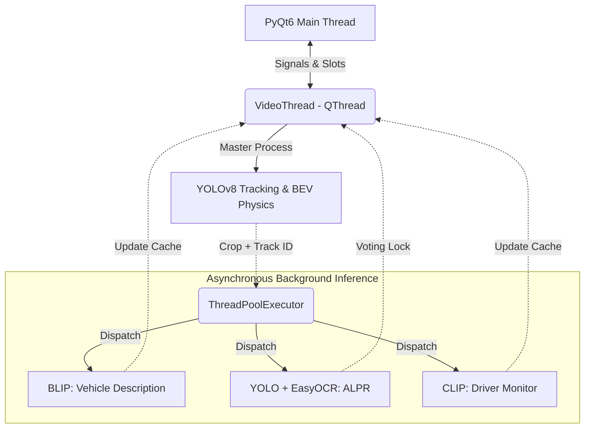

<div align="center">
  
# 🛡️ Nexus: Real-Time Traffic Intelligence System
**Advanced Computer Vision & Multi-Model Inference Pipeline**

[](#)
[](#)
[](#)
[](#)

</div>

## 📌 Executive Summary

**Nexus Traffic Intelligence** is an enterprise-grade, multi-model artificial intelligence pipeline built for real-time traffic monitoring, behavioral tracking, and forensic data gathering. 

Powered by a dual-threaded Master-Slave architecture, the system coordinates ultra-fast YOLO-based tracking on the main AI thread with asynchronous execution of heavy Vision Transformers (BLIP, CLIP) and Optical Character Recognition (EasyOCR) in the background. Encased in a beautiful, flicker-free PyQt6 desktop application, Nexus brings automated situational awareness to IP cameras and video feeds.

---

## 🚀 Core Features

### 1. Object Detection & Tracking
At the heart of the pipeline rests **YOLOv8** coupled with tracking (DeepSORT/ByteTrack internal implementations). Vehicles are detected, typed (Car, Truck, Bus, Motorcycle), and assigned persistent `Track_ID`s that survive temporary occlusions, ensuring tracking stability frame over frame.

### 2. Speed Estimation & Physics Calibration
Nexus departs from naive pixel-height speed approximations by leveraging a **Bird's-Eye View (BEV) Homography Calibrator**. By mapping a 2D perspective space into a top-down physical plane using `cv2.getPerspectiveTransform`, the system measures precise pixel-per-meter displacement across a temporal tracking history, yielding highly accurate `km/h` estimations.

### 3. Direction & Wrong-Way Detection
The spatial engine plots the vehicle's $Y$-axis momentum vector (e.g., `-THRESHOLD <= delta_y <= THRESHOLD` resolving to `STATIONARY`). A dynamic interactive counting line maps the X-axis coordinate to an assigned lane (`LEFT/RIGHT`), comparing the live momentum against user-configured expected traffic flows (e.g., "Standard" or "Reversed") to instantaneously trigger **Wrong-Way** alerts and paint bounding boxes red.

### 4. Vehicle Cognitive Description
Using **Salesforce BLIP (Vision Transformer)**, the system crops targeted vehicles exceeding a minimum resolution threshold and generates zero-shot human-readable physical descriptions (e.g., *"Silver SUV with roof rack"*), adding semantic depth to forensic logs.

### 5. Optimized ALPR (Automatic License Plate Recognition)
Recognizing that running OCR on every frame is prohibitively expensive, Nexus employs a **Polling Consensus Algorithm**. When a vehicle meets dimensional constraints, a Slave thread isolates the plate (falling back to geometric heuristics if dedicated plate models fail) and triggers **EasyOCR**. Real-time results are buffered in a polling queue (`plate_history`) until statistical mode consensus is reached (e.g., 5 identical reads), after which the `Track_ID` permanently "locks" the plate string.

### 6. Driver Monitoring System (DMS)
The pipeline isolates the upper windshield geometry of approaching vehicles and dispatches the tensor to **OpenAI's CLIP (Zero-Shot Classification)**. CLIP analyzes the crop against text embeddings to determine driver compliance (e.g., `Belt: ✅ | Phone: ❌`).

### 7. Real-Time UI & Dashboard
The entire engine runs behind a sleek, dark-themed **PyQt6** dashboard. Features include:
*   Flicker-free tracking rendering via Exponential Moving Average (EMA) coordinate smoothing.
*   Interactive dynamic lane-divider `QSlider`.
*   Asynchronous event streaming to a `QTableWidget` for historical logging.
*   Automatic CSV session export and summary modals showing max speeds, total density counts, and behavioral flags.

---

## 🏗️ System Architecture & Pipeline

Nexus solves the classic "Heavy Model Bottleneck" using a **Master-Slave Threading Architecture**.



*   **GUI Thread (`main_window.py`)**: Renders the UI, manages state, and processes signals without blocking.
*   **Video Thread (`VideoThread`)**: Runs the master video frame loop and YOLO tracking synchronously.
*   **Slave Pool (`ThreadPoolExecutor`)**: Handles heavy multimodal inference. Because these models run entirely off-thread, the primary video feed maintains high FPS. Final inferences silently update the primary dictionaries.

---

## 💻 Tech Stack & Technologies Used

*   **Core Language:** Python 3.10+
*   **Computer Vision:** OpenCV (`cv2`), NumPy
*   **Deep Learning & Tracking:** Ultralytics YOLOv8, PyTorch (`torch`)
*   **Multimodal AI (Vision-Language):** Hugging Face Transformers (`transformers`) for BLIP and CLIP
*   **Optical Character Recognition:** EasyOCR
*   **Desktop App Framework:** PyQt6

---

## ⚙️ Setup & Installation Guide

### Prerequisites
*   Python 3.10 or higher.
*   An NVIDIA GPU (CUDA toolkit installed) is *highly recommended* for real-time inference speeds.

### 1. Clone & Environment Setup
```bash
git clone https://github.com/your-username/nexus-traffic-intelligence.git
cd nexus-traffic-intelligence

# Create a virtual environment
python -m venv venv
# Activate on Windows:
venv\Scripts\activate
# Activate on Linux/Mac:
source venv/bin/activate
```

### 2. Install Dependencies
```bash
# Prioritize PyTorch with CUDA support if applicable:
pip3 install torch torchvision torchaudio --index-url https://download.pytorch.org/whl/cu118

# Install project requirements
pip install -r requirements.txt
```

*(Note: Ensure `ultralytics`, `transformers`, `easyocr`, `opencv-python`, and `PyQt6` are listed in your `requirements.txt`)*

### 3. Run the Application
```bash
python main.py
```
*   Select your processing source (Webcam, Upload Video, or RTSP IP Camera string).
*   Toggle features (Speed, Density, Behavior) to tailor performance to your hardware tier.

---

## 🔭 Future Enhancements

1.  **Cloud Sync & Database Integration (SQL/Postgres)**
    *   *Implementation:* Transition the memory-only `session_data` dictionary to a localized SQLite or remote PostgreSQL database table, opening the door for analytical web-dashboards (Grafana/Metabase) covering multi-day traffic density reports.
2.  **Night-Vision & Adverse Weather Optimization**
    *   *Implementation:* Integrate a lightweight ESRGAN (Enhanced Super-Resolution Generative Adversarial Network) pre-processing step or employ specialized infra-red trained YOLO weights to normalize tracking accuracy during severe rain, snow, or low-light CCTV exposure.
3.  **Calibrated Speed Zones**
    *   *Implementation:* Allow the user to drag multi-point polygon ROIs on the video feed to map discrete speed limits to specific lanes (e.g., 80km/h on the highway lane, 40km/h on the off-ramp), granting granular alerting capabilities.
